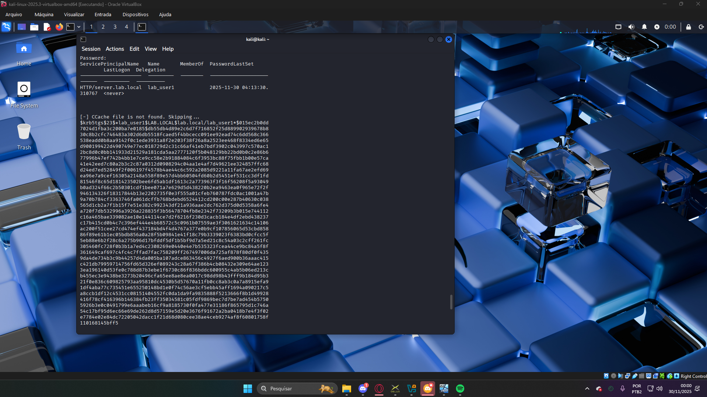

# Active Directory Hacking: Kerberoasting Attack 🏢

Neste laboratório foi simulado uma infraestrutura corporativa completa (Windows Server 2022 + Active Directory) para executar ataques de identidade.

O objetivo foi explorar a técnica de **Kerberoasting**: solicitar um ticket de serviço (TGS) para uma conta vulnerável e extrair o hash da senha para quebra offline.

## ⚙️ Arquitetura do Lab
* **Domain Controller (DC):** Windows Server 2022 (Configurado com AD DS e DNS).
* **Atacante:** Kali Linux (Impacket Tools).
* **Rede:** Internal Network isolada com endereçamento estático.

## ⚔️ O Ataque (Passo a Passo)
1.  **Configuração do Alvo:** Criei um usuário de serviço (`lab_user1`) e registrei um SPN (Service Principal Name) para torná-lo vulnerável.
2.  **Bypass de Tempo:** Superei o mecanismo de segurança do Kerberos (Time Skew) sincronizando manualmente os relógios do DC e do Kali.
3.  **Extração:** Utilizei o script `GetUserSPNs.py` para solicitar o ticket TGS.

### 📸 Prova de Conceito (PoC)
A imagem abaixo mostra o sucesso do ataque: o DC validou a requisição e retornou o hash NTLMv2 do usuário alvo, que agora pode ser quebrado via Hashcat/John.

## 🔧 Desafios & Troubleshooting
Durante a configuração, enfrentei e solucionei desafios reais de infraestrutura que impediam o ataque:

1.  **Falha de DNS na Rede Interna:**
    * **Problema:** O Kali não resolvia o domínio `lab.local` mesmo estando na mesma rede.
    * **Solução:** Configurei IPs estáticos e apontei manualmente o DNS do Kali (`/etc/resolv.conf`) para o IP do Domain Controller. Também precisei desativar o Firewall do Windows Server para permitir tráfego na porta 53/ICMP.

2.  **Erro de Kerberos (Clock Skew):**
    * **Problema:** O ataque falhava com o erro `KRB_AP_ERR_SKEW`. Descobri que o protocolo Kerberos exige sincronia de tempo precisa (<5 min).
    * **Solução:** Forcei a sincronização de horário entre as máquinas virtualizadas via CMD (`time HH:MM:SS`), alinhando os relógios do Windows e Kali para permitir a validação do ticket.

## 🧠 Aprendizado
Este lab consolidou meu conhecimento em:
* Administração de Windows Server e Active Directory.
* Protocolo Kerberos e suas falhas de design.
* Troubleshooting avançado de redes (DNS, Firewall e NTP).

---
*Projeto realizado em ambiente virtual isolado.*
