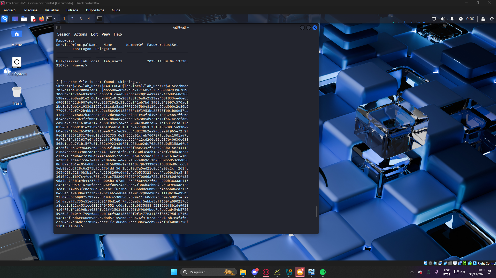

# Exploração de Identidade em Active Directory: Kerberoasting Attack 🏢

Simulação de ataque em infraestrutura corporativa baseada em Windows Server 2022 para exfiltração e quebra de hashes de contas de serviço. O foco foi explorar a fragilidade do protocolo Kerberos ao solicitar tickets de serviço (TGS) para contas com SPNs registrados.

## Ambiente de Laboratório
* **Domain Controller (DC):** Windows Server 2022 (AD DS e DNS configurados).
* **Host Atacante:** Kali Linux (Utilizando Impacket Suite).
* **Rede:** Segmento interno isolado com endereçamento estático para consistência dos testes.

## Vetor de Ataque: Kerberoasting
O ataque consistiu em induzir o Active Directory a fornecer um ticket de serviço cifrado com a chave da conta alvo, permitindo a tentativa de brute-force offline.

1. **Configuração do Alvo:** Criação do usuário `lab_user1` e registro manual de um Service Principal Name (SPN) para simular uma conta de serviço vulnerável.
2. **Coleta de Tickets:** Uso do script `GetUserSPNs.py` (Impacket) para consultar o DC e solicitar os tickets TGS das contas que possuem SPNs associados.
3. **Extração de Hash:** O ticket capturado contém o hash da senha do usuário de serviço, pronto para processamento em ferramentas de cracking.

### Evidência Técnica (PoC)
A captura abaixo demonstra o DC retornando o hash NTLMv2 após a validação da requisição. Este artefato é o ponto de partida para a quebra de senha via wordlist:

## Troubleshooting de Infraestrutura
A fase de setup apresentou obstáculos reais de rede e protocolo que exigiram ajustes manuais:

* **Resolução de Nomes (DNS):**
  O Kali Linux não conseguia resolver o FQDN `lab.local`. Para corrigir, apontei o `/etc/resolv.conf` diretamente para o IP do Domain Controller e validei a comunicação ICMP/Porta 53, garantindo que o tráfego de autenticação seguisse o caminho correto.

* **Sincronismo de Tempo (Clock Skew):**
  O Kerberos falhava com o erro `KRB_AP_ERR_SKEW`. Como o protocolo tolera uma diferença máxima de 5 minutos entre as máquinas, precisei sincronizar manualmente o relógio do Kali com o do DC via linha de comando para permitir a validação dos tickets gerados.

## Notas Técnicas
Este laboratório reforçou a importância do gerenciamento de identidades (IAM). A principal mitigação para o Kerberoasting não é apenas o monitoramento, mas garantir que contas de serviço utilizem senhas longas (>25 caracteres) ou sejam migradas para **Group Managed Service Accounts (gMSA)**, onde a rotação de senha é automatizada e complexa.

---
*Laboratório focado em Pentest Interno e Segurança de Infraestrutura.*
